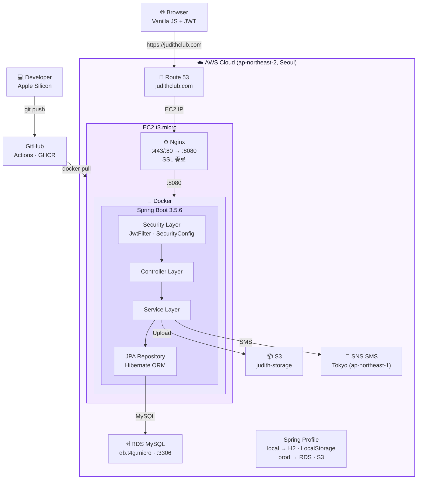
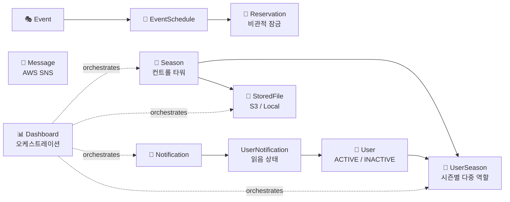
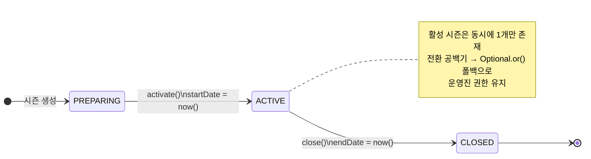
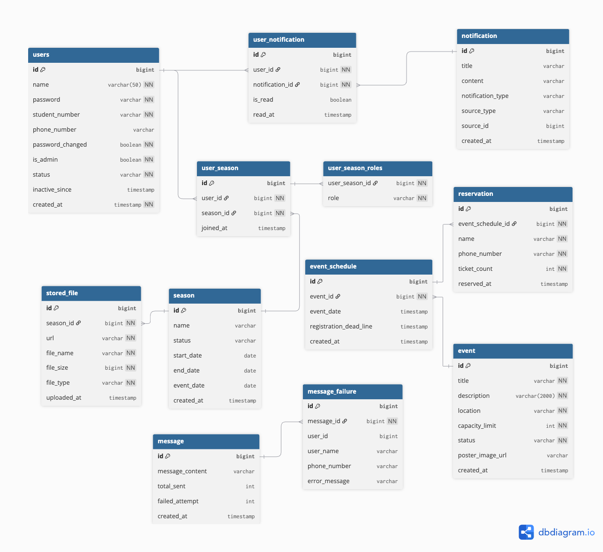
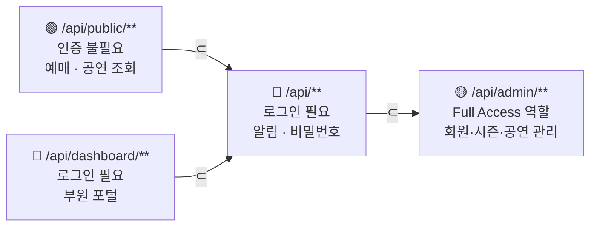

# Judith Management System

대학교 연극 동아리를 위한 풀스택 종합 관리 시스템.
3년간 운영진으로 직접 겪은 반복 업무(예매, 알림, 정산)를 해결하기 위해 기획·설계·구현한 개인 프로젝트.
2026년 1학기 공연 〈물리학자들〉을 대상으로 테스트 운영 중이며, 2학기 정식 도입 예정.

**🌐 실서비스:** [judithclub.com](https://judithclub.com)

---

## 기술 스택

| 분류 | 기술 |
|------|------|
| Backend | Java 21, Spring Boot 3.5.6, Spring Security, Spring Data JPA |
| Database | H2 (local), MySQL 8 / AWS RDS (prod) |
| 인증 | JWT (Stateless, 7일 단일 토큰) |
| 스토리지 | LocalStorageService (local) / AWS S3 (prod) |
| 메시지 | AWS SNS — SMS 발송 (ap-northeast-1, Tokyo) |
| 인프라 | AWS EC2 t3.micro, Nginx, Docker, GHCR |
| DNS / SSL | Route 53 (A 레코드), Let's Encrypt (Certbot 자동 갱신) |
| 테스트 | JUnit 5, Mockito |
| Frontend | Vanilla JS, HTML, CSS |

---

## 시스템 아키텍처



---

## 도메인 구조



---

## 시즌 상태 머신



---

## ERD



---

## API 구조



| 접근 수준 | 경로 | 주요 기능 |
|-----------|------|-----------|
| PUBLIC | `/api/public/` | 공연 조회, 예매, 예매 조회·취소, 시즌 카운트다운 |
| MEMBER | `/api/` | 비밀번호 변경, 알림 조회·읽음 처리 |
| DASHBOARD | `/api/dashboard/` | 시즌 정보, 대본, 공지, 캘린더 |
| ADMIN | `/api/admin/` | 회원·시즌·공연·SMS·파일 관리 |

---

## 주요 설계 결정

| 결정 | 선택 | 이유 |
|------|------|------|
| 예매 잠금 | 비관적 잠금 | 소규모 좌석, 높은 경합 — 실패가 지연보다 나쁜 UX |
| 졸업생 처리 | 상태 Enum (단일 테이블) | 테이블 분리 시 모든 FK 파괴 |
| 시즌별 다중 역할 | `@ElementCollection` | 별도 엔티티 없이 JPA가 join 테이블 자동 관리 |
| SMS | AWS SNS (Tokyo) | 국내 업체는 사업자등록번호 필수 |
| 스토리지 | Interface + `@Profile` | 컨트롤러 수정 없이 Local ↔ S3 전환 |
| 알림 | Spring Events | AuthController가 Notification 도메인을 직접 참조하지 않도록 분리 |
| 시즌 공백기 | `Optional.or()` 3단계 폴백 | 시즌 전환 중 운영진 잠금 방지 |
| Refresh Token | 미적용 | 사용자 20~30명, 저민감 데이터 — 복잡도 대비 보안 이득 낮음 |

---

## 패키지 구조

```
src/main/java/com/judtih/judith_management_system/
├── domain/
│   ├── calendar/          # CalendarEvent (Phase 2 — 개발 중)
│   ├── dashboard/         # 부원 포털 오케스트레이션 (엔티티 없음)
│   ├── message/           # AWS SNS SMS
│   ├── reservation/       # Event → EventSchedule → Reservation 3계층
│   ├── season/            # 컨트롤 타워
│   └── user/              # User + UserSeason
└── global/
    ├── notification/      # Notification + UserNotification + Spring Events
    ├── security/          # JWT 필터 + SecurityConfig
    └── storage/           # StorageService 인터페이스 + @Profile 구현체
```

---

## 로컬 실행

**요구사항:** Java 21, Gradle

```bash
git clone https://github.com/Preta3418/Judith.git
cd Judith/judith-management-system
./gradlew bootRun --args='--spring.profiles.active=local'
```

`application-local.properties` 최소 설정:

```properties
spring.datasource.url=jdbc:h2:mem:testdb
spring.datasource.driver-class-name=org.h2.Driver
spring.jpa.hibernate.ddl-auto=create-drop

aws.accessKey=dummy
aws.secretKey=dummy
aws.SnsRegion=ap-northeast-1
aws.defaultRegion=ap-northeast-2
```

---

## 테스트

```bash
./gradlew test
```

| 클래스 | 케이스 | 검증 내용 |
|--------|--------|-----------|
| `DashboardServiceTest` | 7개 | assertMembership 403, ACTIVE 시즌 공지 강제, myFullAccess 파생 계산 |
| `ReservationServiceTest` | 5개 | 정상 예매, 마감, 기한 초과, 중복 전화번호, 좌석 부족 |

---

## 라이선스

개인 프로젝트 — 상업적 사용 금지.
