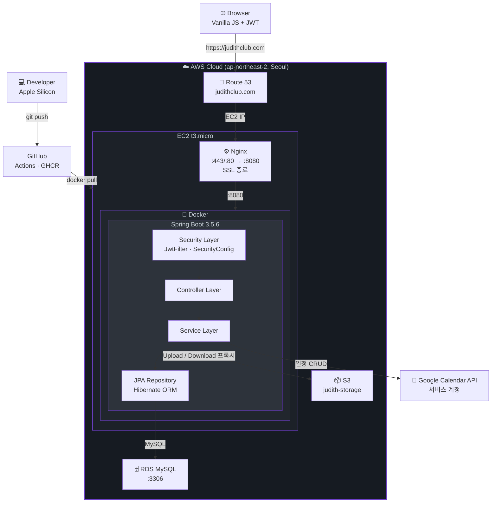
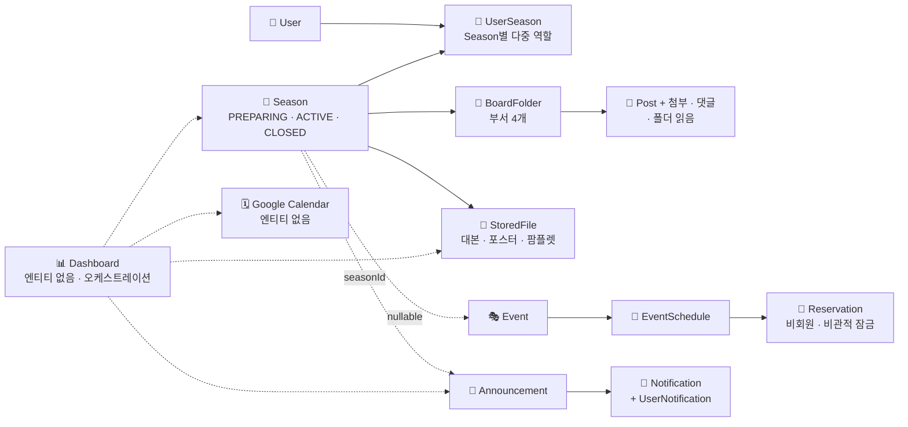
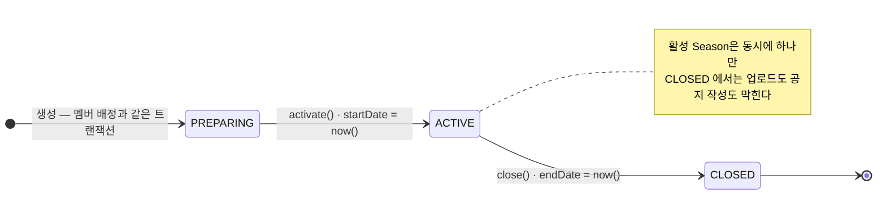
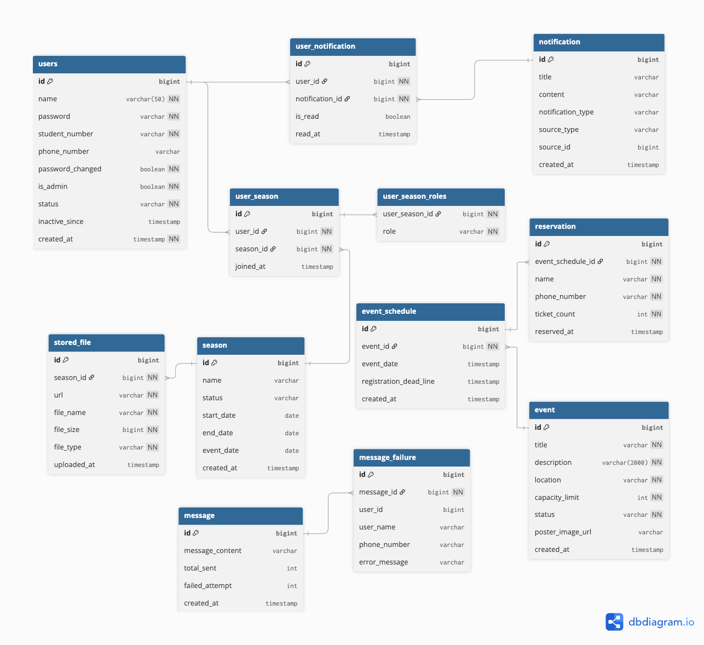
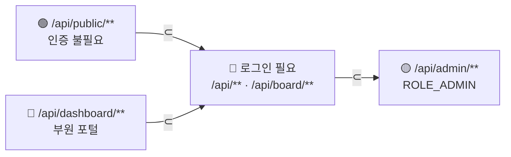

# Judith Management System

대학 연극 동아리의 한 학기를 통째로 담는 관리 시스템입니다.
3년간 운영진으로 있으면서 **정보가 연출 한 사람을 거쳐야만 흐르던 구조**를 바꾸려고 만들었습니다.
기획·설계·백엔드·인프라 단독 개발.

**🌐 실서비스** [judithclub.com](https://judithclub.com) · **📐 ERD** [dbdiagram.io](https://dbdiagram.io/d/JUDITH-6a70b389829f06bdc8723cf2)

---

## 실제로 쓰였습니다

2026년 1학기 정기공연 〈물리학자들: Die Physiker〉(7월, 2일간)에 투입했습니다.

| | 결과 |
|---|---|
| 총 관객 | **81명** |
| 웹 예매 | **78장 / 48건 — 96%** (나머지 3명은 현장 구매) |
| 팜플렛 | 관객 **81명 전원** 배포 (입장 시 QR, 종이 인쇄 0장) |
| 부원 사용 | **20명** — 대시보드·공지·대본·게시판 |

공연은 종료됐고 2학기부터 정식 운영합니다.

---

## 무엇을 풀었나

한 학기가 끝나면 아무것도 남지 않는 것이 문제였습니다.

| 흩어져 있던 것 | 어디에 있었나 | 지금 |
|---|---|---|
| 공지 | 단톡방 — 대화에 밀려 사라짐 | Season에 귀속, 상단 고정 |
| 대본 | 드라이브 링크를 카톡으로 | Season별 파일 목록, 개정본 순서대로 |
| 부서별 진행 상황 | 파트 톡방 4개 (무대·음향·인쇄·소품) | 부서 게시판 4개 — 폴더·첨부·댓글 |
| 일정 | 동아리 계정 캘린더 → 운영진만 열람 | Google Calendar 서비스 계정 연동, 부원 전체 열람 |
| 예매 | 구글폼 — 계정 가진 한 사람만 확인 가능 | 회차별 예약자 화면, 공연 당일 입구에서 출석 체크 |

**설계의 축은 Season 하나입니다.** 자료가 전부 Season에 묶이므로 학기가 끝나면 그 Season이 곧 그 학기의 기록이 됩니다.

---

## 기술 스택

| 분류 | 기술 |
|---|---|
| Backend | Java 21 · Spring Boot 3.5.6 · Spring Security · Spring Data JPA |
| Database | H2 (local) · MySQL / AWS RDS (prod) |
| 인증 | JWT — Stateless, 7일 단일 토큰 |
| 스토리지 | `StorageService` 인터페이스 — LocalStorage (local) / AWS S3 (prod) |
| 외부 연동 | Google Calendar API (서비스 계정) · AWS SNS SMS (폐기, 아래 참고) |
| 인프라 | AWS EC2 t3.micro · Nginx · Docker · GHCR · GitHub Actions |
| DNS / SSL | Route 53 · Let's Encrypt (Certbot 자동 갱신) |
| 테스트 | JUnit 5 · Mockito |
| Frontend | Vanilla JS · HTML · CSS |

```
코드 21,211줄 (백엔드 6,744 · 테스트 1,737 · 프론트 12,730)
엔티티 19개 · REST API 84개 · 테스트 84개 / 11클래스 · 커밋 178개
```

---

## 시스템 아키텍처


```mermaid
graph TB
    Browser["🌐 Browser\nVanilla JS + JWT"]
    Dev["💻 Developer\nApple Silicon"]
    GitHub["GitHub\nActions · GHCR"]
    Route53["📖 Route 53\njudithclub.com"]

    Browser -->|"https://judithclub.com"| Route53
    Dev -->|"git push"| GitHub
    GitHub -->|"docker pull"| EC2

    subgraph AWS ["☁️ AWS Cloud (ap-northeast-2, Seoul)"]
        Route53 -->|"EC2 IP"| Nginx
        subgraph EC2 ["EC2 t3.micro"]
            Nginx["⚙️ Nginx\n:443/:80 → :8080\nSSL 종료"]
            subgraph Docker ["🐳 Docker"]
                subgraph Spring ["Spring Boot 3.5.6"]
                    SEC["Security Layer\nJwtFilter · SecurityConfig"]
                    CTR["Controller Layer"]
                    SVC["Service Layer"]
                    REPO["JPA Repository\nHibernate ORM"]
                    SEC --> CTR --> SVC --> REPO
                end
            end
        end

        RDS["🗄️ RDS MySQL\n:3306"]
        S3["📦 S3\njudith-storage"]
        Nginx -->|":8080"| Docker
    end

    GCAL["📅 Google Calendar API\n서비스 계정"]

    REPO -->|MySQL| RDS
    SVC -->|Upload / Download 프록시| S3
    SVC -->|일정 CRUD| GCAL

    style AWS fill:#161b22,stroke:#6e40c9,stroke-width:2px,color:#c9d1d9
    style EC2 fill:#1c2128,stroke:#6e40c9,stroke-width:1.5px,color:#c9d1d9
    style Docker fill:#21262d,stroke:#6e40c9,stroke-width:1px,color:#c9d1d9
    style Spring fill:#2d333b,stroke:#7c3aed,stroke-width:1px,color:#c9d1d9
```

Apple Silicon에서 빌드해 x86 EC2로 보내므로 이미지는 `--platform linux/amd64`로 고정합니다.

---

## 도메인 구조


```mermaid
graph LR
    Season["📅 Season\nPREPARING · ACTIVE · CLOSED"]
    User["👤 User"]
    UserSeason["🔗 UserSeason\nSeason별 다중 역할"]
    BoardFolder["📂 BoardFolder\n부서 4개"]
    Post["📝 Post + 첨부 · 댓글\n· 폴더 읽음"]
    Storage["📁 StoredFile\n대본 · 포스터 · 팜플렛"]
    Ann["📢 Announcement"]
    Event["🎭 Event"]
    Sched["📆 EventSchedule"]
    Resv["🎫 Reservation\n비회원 · 비관적 잠금"]
    Noti["🔔 Notification\n+ UserNotification"]
    Cal["🗓️ Google Calendar\n엔티티 없음"]
    Dash["📊 Dashboard\n엔티티 없음 · 오케스트레이션"]

    User --> UserSeason
    Season --> UserSeason
    Season --> Storage
    Season --> BoardFolder --> Post
    Season -.->|seasonId| Ann
    Season -.->|nullable| Event
    Event --> Sched --> Resv
    Ann --> Noti
    Dash -.-> Season
    Dash -.-> Storage
    Dash -.-> Ann
    Dash -.-> Cal
```

실선은 `nullable = false`인 Season 외래키입니다. 점선 둘은 예외입니다 —
공지는 Season 식별자만 값으로 들고 있고, 공연은 학기에 하나뿐이라 활성 Season이 암묵적입니다.

`Dashboard`와 `Calendar`는 **자기 엔티티가 없습니다.** 대시보드는 기존 도메인을 조합하기만 하고,
일정은 Google Calendar를 그대로 씁니다.

---

## Season 상태 머신

한 학기가 여기서 열리고 닫히며, **그 상태가 전 도메인의 쓰기 권한을 정합니다.**


```mermaid
stateDiagram-v2
    direction LR
    [*] --> PREPARING : 생성 — 멤버 배정과 같은 트랜잭션
    PREPARING --> ACTIVE : activate() · startDate = now()
    ACTIVE --> CLOSED : close() · endDate = now()
    CLOSED --> [*]

    note right of ACTIVE
        활성 Season은 동시에 하나만
        CLOSED 에서는 업로드도 공지 작성도 막힌다
    end note
```

**전환 공백기에 운영진이 잠기는 문제가 있었습니다.** 이전 Season이 CLOSED이고 새 Season이 아직
PREPARING이면 아무도 full-access 역할을 갖지 못해 멤버 배정 화면에조차 못 들어갑니다.

- 증상 차단 — `Optional.or()` 3단 폴백: `ACTIVE → PREPARING → 최근 CLOSED`
- 근본 원인 제거 — 원인은 "멤버가 없는 Season"이 존재할 수 있다는 것이라, **생성과 멤버 배정을 한 트랜잭션으로** 묶었습니다

트랜잭션을 롤백 장치가 아니라 **불변식을 강제하는 장치**로 썼습니다.

---

## 접근 제어

권한 판단이 네 층에 나뉘어 있고, **각 층이 서로 다른 질문에 답합니다.**

| 층 | 어디 | 답하는 질문 |
|---|---|---|
| URL | `SecurityConfig` 매처 4단계 | 로그인이 필요한 경로인가 |
| 토큰 | `JwtUtil` · `JwtAuthenticationFilter` | 누구이고 full-access인가 |
| 메서드 | `@PreAuthorize("authentication.details == #userId")` | 자기 자원인가 (DB 조회 없이) |
| 서비스 | `assertReadAccess` · `assertCanPost` · `assertSeasonWritable` | 이 Season에서 이걸 해도 되는가 |

`ROLE_ADMIN` / `ROLE_USER` 매핑은 필터 한 곳에서만 일어납니다. 토큰에는 역할 문자열이 없어서
권한 체계를 바꿔도 이미 발급된 토큰이 깨지지 않습니다.

**읽기와 쓰기를 다른 기준으로 갈랐습니다.**

```
쓰기  ←  Season 상태가 정한다      ACTIVE 가 아니면 업로드도 공지 작성도 막힌다
읽기  ←  현재 소속이 정한다        지금 활동 중인 Season 에 속해 있으면 지난 Season 도 열람 가능
```

읽기를 넓게 열어도 되는 이유는 쓰기가 이미 상태로 막혀 있기 때문입니다. 과거 자료는 누구도 고칠 수 없습니다.

---

## ERD

📐 **[dbdiagram.io에서 보기](https://dbdiagram.io/d/JUDITH-6a70b389829f06bdc8723cf2)**

<!-- docs/erd.png 는 Board·Announcement 도입 이전 버전이라 뺐다.
     dbdiagram 에서 다시 내보내면 여기에  로 되살릴 것. -->

---

## API


```mermaid
graph LR
    PUBLIC["🟢 /api/public/**\n인증 불필요"]
    MEMBER["🔵 로그인 필요\n/api/** · /api/board/**"]
    DASHBOARD["🔵 /api/dashboard/**\n부원 포털"]
    ADMIN["🟡 /api/admin/**\nROLE_ADMIN"]

    PUBLIC -->|"⊂"| MEMBER
    MEMBER -->|"⊂"| ADMIN
    DASHBOARD -->|"⊂"| MEMBER
```

**총 84개** — GET 37 · POST 25 · PUT 13 · DELETE 9

| 접근 | 경로 | 개수 | 주요 기능 |
|---|---|---|---|
| 공개 | `/api/public/**` | 11 | 현재 공연 · D-Day · 예매 · 예약 조회·취소 · 팜플렛 · 로그인 |
| 부원 | `/api/dashboard/**` | 8 | 내 Season · 대본 · 공지 · 일정 |
| 게시판 | `/api/board/**` | 18 | 폴더 · 글 · 첨부 · 댓글 · 고정 · 내려받기 |
| 로그인 | `/api/**` | 7 | 내 알림 · 읽음 처리 · 비밀번호 변경 |
| 운영진 | `/api/admin/**` | 40 | Season 생성·활성화·종료 · 멤버 배정 · 공연 · 회차 · 공지 · 업로드 · 일정 |

`/api/board/**`에는 **SecurityConfig 규칙이 없습니다.** `anyRequest().authenticated()`로만 걸리고,
그다음 판단은 전부 서비스 계층이 합니다.

---

## 주요 설계 결정

| 결정 | 선택 | 이유 |
|---|---|---|
| Season 생성 | 멤버 배정까지 한 트랜잭션 | 멤버 없는 Season 자체가 만들어질 수 없게 |
| 비회원 예매 | `(event_schedule_id, phone_number)` 복합 UNIQUE | 계정 없이 받되 중복은 DB 제약으로 차단 |
| 예매 동시성 | `@Lock(LockModeType.PESSIMISTIC_WRITE)` | 좌석은 실패보다 지연이 낫다. **규모가 커져도 깨지지 않게 한 설계 판단** |
| 잔여석 | 저장하지 않고 매번 합산 | 적힌 숫자와 실제가 어긋날 여지 자체를 없앰 |
| 게시판 폴더 | 실제 경로로 만들지 않고 DB 컬럼으로만 | 옮겨도 S3 키가 안 바뀌어 기존 링크가 안 깨짐 |
| 전원 허용 부서 | `targetRoles` 빈 집합 | 예외 분기 대신 **빈 집합에 의미를 부여** (알림도 같은 규칙) |
| 파일 내려받기 | 서버 프록시 (`FileDownloadService`) | iOS Safari가 `download` 속성을 무시 → `Content-Disposition`을 서버가 붙임 |
| 졸업생 처리 | 상태 enum (단일 테이블) | 테이블을 분리하면 예매·메시지·Season 기록의 FK가 전부 끊김 |
| Season별 다중 역할 | `@ElementCollection` | 별도 엔티티 없이 조인 테이블을 JPA가 관리 |
| 스토리지 | 인터페이스 + `@Profile` | 컨트롤러에 환경 분기가 한 줄도 없음 |
| 알림 | Spring Events | `AuthController`가 Notification 도메인을 직접 참조하지 않도록 |
| 일정 | 자체 엔티티 폐기, Google Calendar 임베드 | 화면 한 벌 + 동기화 계층을 유지할 만큼 일정이 자주 오가지 않음 |
| 문자 발송 | **만들어서 굴려본 뒤 접음** | 아래 참고 |
| enum 컬럼 | `preferred_enum_jdbc_type=VARCHAR` | 아래 참고 |
| Refresh Token | 미적용 | 사용자 20~30명 · 저민감 · 간헐 접속 — 복잡도 대비 이득이 낮음 |

### 문자 발송을 접은 이유

국내 SMS 업체는 사업자등록번호를 요구해 학생 동아리는 발급받을 수 없습니다. AWS SNS 도쿄 리전으로
우회해 만들었고, 발송은 **API 기준 100% 성공**했습니다.

그런데 정말 받았는지는 알 수 없었습니다. **같은 문자로 "받으셨나요?"를 물으면 안 됩니다** — 못 받은
사람은 그 질문도 못 받으니까요. 문자가 아닌 경로로 확인했더니 **절반 가까이가 못 받고 있었습니다.**
발신번호가 해외 번호로 표시돼 단말과 통신사가 자동 차단한 것이었습니다.

AWS SNS는 전부 성공으로 응답했고, 실패 추적용 `MessageFailure`도 이걸 잡지 못했습니다. 실패가 SNS
바깥에서 일어났기 때문입니다. **기능을 쓰지 않기로 했습니다.** 코드는 그대로 남아 있습니다.

### enum 컬럼을 VARCHAR로 강제한 이유

Hibernate 6 + MySQL은 `@Enumerated(STRING)`을 **네이티브 `enum('A','B',…)` 컬럼**으로 만듭니다.
MySQL ENUM은 생성 시점에 값 목록이 박히고, `ddl-auto=update`는 컬럼을 추가할 뿐 타입을 바꾸지 않습니다.

게시판을 배포하면서 열거형에 값을 더했더니 **운영에서만 글쓰기가 403으로 막혔습니다.** 로컬은 H2라
매번 새로 만드니 영영 재현되지 않았고, 테스트도 전부 통과했습니다. 응답에 메시지도 없어서 서버 로그로만
찾았습니다.

```properties
spring.jpa.properties.hibernate.type.preferred_enum_jdbc_type=VARCHAR
```

> ⚠️ 이 설정은 **새로 만들어지는 컬럼에만** 적용됩니다. 이미 ENUM으로 굳은 컬럼은
> `ALTER TABLE … MODIFY … VARCHAR(50)`이 한 번 필요합니다.

---

## 패키지 구조

```
src/main/java/com/judtih/judith_management_system/
├── domain/
│   ├── announcement/   # Season 공지 (Notification 재사용을 되돌려 분리)
│   ├── board/          # 부서 게시판 — BoardFolder · Post · 첨부 · Comment · FolderReadStatus
│   ├── calendar/       # Google Calendar API 연동 (엔티티 없음)
│   ├── dashboard/      # 부원 포털 오케스트레이션 (엔티티 없음)
│   ├── gallery/        # EventShowcase — 미완
│   ├── message/        # AWS SNS SMS (폐기, 코드 유지)
│   ├── reservation/    # Event → EventSchedule → Reservation 3계층
│   ├── season/         # 상태 머신 · 모든 도메인의 축
│   └── user/           # User + UserSeason
└── global/
    ├── config/         # AwsConfig · GoogleCalendarConfig · WebConfig
    ├── download/       # FileDownloadService — S3 프록시 (팜플렛 · 게시판 첨부 공용)
    ├── exception/      # 예외가 자기 상태코드를 소유, 핸들러 1개
    ├── init/           # LocalDataInitializer — 로컬 시드
    ├── notification/   # Notification + UserNotification + Spring Events
    ├── security/       # JWT 필터 + SecurityConfig
    └── storage/        # StorageService 인터페이스 + @Profile 구현체
```

---

## 로컬 실행

**요구사항** Java 21 · Gradle

```bash
git clone https://github.com/Preta3418/Judith.git
cd Judith/judith-management-system
./gradlew bootRun --args='--spring.profiles.active=local'
```

`src/main/resources/application-local.properties`를 직접 만들어야 합니다. `.gitignore` 대상입니다.

```properties
spring.datasource.url=jdbc:h2:mem:testdb
spring.datasource.driver-class-name=org.h2.Driver
spring.jpa.hibernate.ddl-auto=create-drop
spring.h2.console.enabled=true

jwt.secret=local-dev-secret-at-least-32-bytes-long-string
jwt.expiration-ms=604800000

upload.base-path=./uploads

# local 프로필은 S3·SNS·Calendar를 실제로 호출하지 않지만,
# @Value 플레이스홀더에 기본값이 없어 비어 있으면 기동에 실패합니다.
aws.accessKeyId=dummy
aws.secretAccessKey=dummy
aws.SnsRegion=ap-northeast-1
aws.defaultRegion=ap-northeast-2
aws.s3.bucket-name=dummy
google.calendar.id=dummy
google.service.account.json=dummy
```

`local` 프로필은 H2와 로컬 파일 저장소(`LocalStorageService`)를 씁니다.
`LocalDataInitializer`가 기동 시 시드 데이터를 넣습니다. prod 시크릿은 전부 GitHub Secrets로 주입됩니다.

---

## 테스트

```bash
./gradlew test
```

**84개 / 11개 클래스 · 전부 통과**

| 클래스 | 케이스 | 검증 내용 |
|---|---|---|
| `SeasonServiceTest` | 14 | 생성 시 활성 Season 중복·full-access 부재 차단, 활성화·종료 전이 조건, 역할 미배정 거부, 카운트다운 |
| `BoardServiceTest` | 14 | 부서 역할별 작성 권한, CLOSED 차단, full-access 우회, 타 게시판 폴더·타 Season 첨부 거부, 폴더 삭제 시 글을 루트로 이동 |
| `EventServiceTest` | 10 | 공연·회차 CRUD, `getLatestEvent` 폴백(OPEN 우선 → 최신 → 없으면 예외), 팜플렛 URL 설정 |
| `UserSeasonServiceTest` | 9 | Season 상태별 합류 분기(PREPARING 선택 / ACTIVE 역할 필수 / CLOSED 차단), 중복 등록, full-access 판정 |
| `DepartmentTest` | 7 | `canPost()` 3단계 — full-access → 빈 집합(전원 허용) → 역할 교집합, `null` 안전성 |
| `UserServiceTest` | 7 | 학번을 초기 비밀번호로 인코딩, 비활성·재활성 전이 조건, 정보 수정 |
| `GoogleCalendarServiceTest` | 6 | 일정 조회·생성·수정·삭제, 종료 시각 미지정 시 시작+1시간 기본값 |
| `DashboardServiceTest` | 6 | 소속 아닌 Season 접근 차단, full-access의 전체 열람, `myFullAccess` 파생 계산 |
| `ReservationServiceTest` | 5 | 정상 예매, 마감, 기한 초과, 중복 전화번호, 좌석 부족 |
| `NotificationServiceTest` | 5 | 개인 발송, Season 전원 팬아웃, 읽음·전체 읽음 처리 |
| `JudithManagementSystemApplicationTests` | 1 | 컨텍스트 로딩 |

---

## 알려진 한계

숨기는 것보다 아는 상태로 두는 편이 낫다고 봤습니다.

| 한계 | 현재 상태 |
|---|---|
| 동시 요청 검증 | 비관적 잠금은 걸었지만 **동시성 테스트는 없습니다.** 단일 스레드 산술 검증까지만 |
| 열람 범위 게이트 | 지난 Season 열람을 허용하는 3단 게이트에 **테스트가 없습니다** |
| 예외 처리 | reservation 도메인 일부가 아직 `RuntimeException`이라 공통 핸들러를 안 탑니다 |
| 파일 내려받기 경로 | 팜플렛·게시판 첨부는 서버 프록시를 거치지만 **대본은 아직 아닙니다.** `FileDownloadService`로 일원화가 남았습니다 |
| 토큰 무효화 | 7일 단일 토큰이라 발급 후 권한을 회수할 방법이 없습니다 |
| 스키마 관리 | `ddl-auto=update`를 쓰는 한 위 enum 사고가 재발할 수 있습니다. 마이그레이션 도구 도입이 필요합니다 |
| 잔여석 조회 | 회차마다 합산 쿼리가 반복됩니다. 정합성을 택한 대가이고 현재 규모에서는 문제가 없습니다 |

---

## 라이선스

개인 프로젝트 — 상업적 사용 금지.
