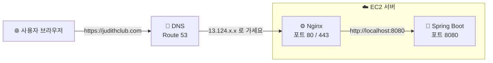
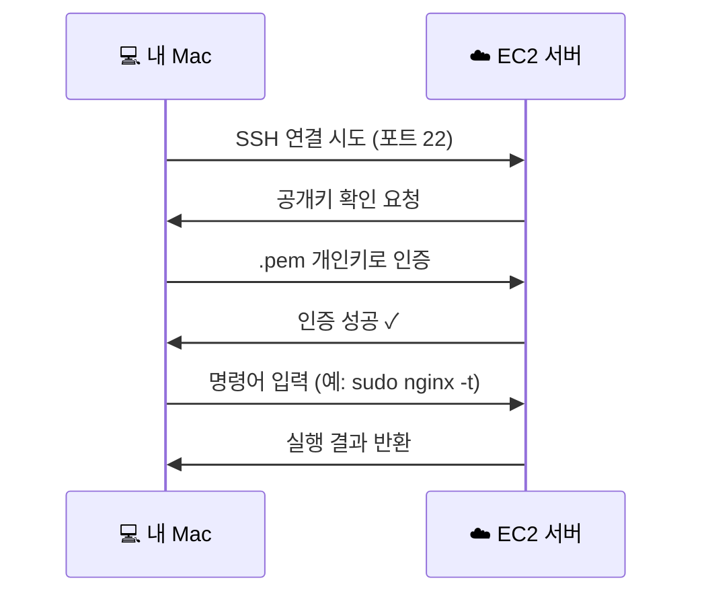
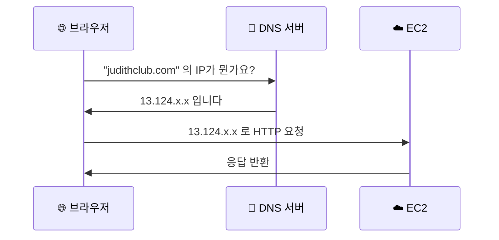
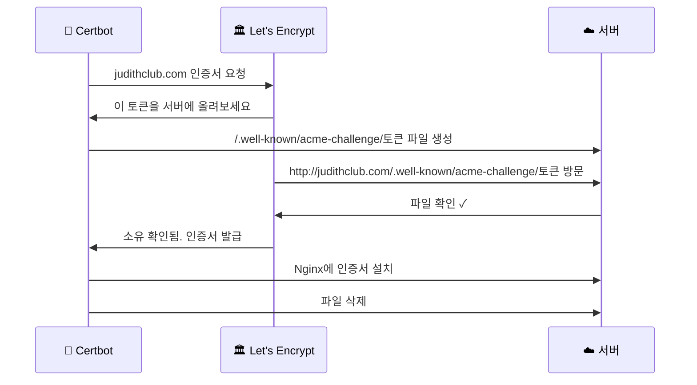
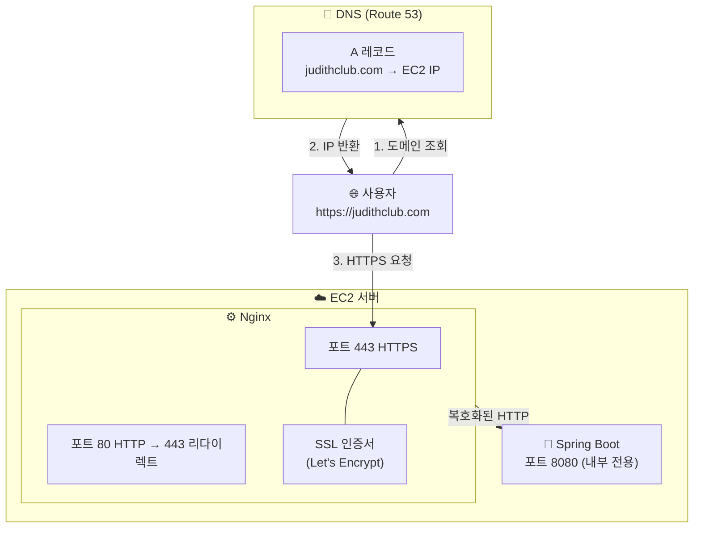

# Web Server, Nginx & HTTPS — 개념부터 설정까지

코드 한 줄 없이도 이해할 수 있도록 그림 위주로 설명합니다.

---

## 1. 전체 그림 먼저

설정이 끝나면 이렇게 생긴 구조가 됩니다:



각 부분이 뭘 하는지 아래에서 하나씩 설명합니다.

---

## 2. 포트란?

서버는 하나의 컴퓨터지만 수천 개의 "문"을 가지고 있습니다. 각 문에 번호가 붙어있는데 그게 포트입니다.

```
┌─────────────────────────────────────┐
│            EC2 서버                  │
│                                     │
│  🚪 포트 22   → SSH (원격 접속)      │
│  🚪 포트 80   → HTTP                │
│  🚪 포트 443  → HTTPS               │
│  🚪 포트 3306 → MySQL               │
│  🚪 포트 8080 → Spring Boot         │
│  🚪 포트 ...  → (나머지는 닫혀있음)  │
│                                     │
└─────────────────────────────────────┘
```

브라우저에서 `http://example.com` 을 입력하면 자동으로 **포트 80**으로 연결됩니다. `https://` 는 **포트 443**. 포트를 명시하지 않으면 이 기본값이 사용됩니다.

`http://example.com:8080` 처럼 `:숫자`를 붙이면 그 포트로 직접 접속합니다.

**왜 Spring Boot를 포트 80에서 직접 실행하지 않나?**

포트 1024 미만은 운영체제가 관리하는 "특권 포트"입니다. root 권한이 있어야 열 수 있습니다. Spring Boot를 root로 실행하는 건 보안상 위험하기 때문에 Nginx가 80/443을 담당하고, Spring Boot는 권한이 필요 없는 8080에서 실행합니다.

---

## 3. SSH — 원격 서버에 접속하기

EC2 서버는 AWS 데이터센터에 있는 물리적 컴퓨터입니다. 직접 앞에 앉아서 타이핑할 수 없으니 SSH로 원격 접속합니다.



`.pem` 파일은 열쇠입니다. EC2는 이 열쇠와 맞는 자물쇠(공개키)를 갖고 있습니다. 맞으면 접속 허용, 틀리면 거부.

```bash
ssh -i /path/to/key.pem ec2-user@서버IP
```

접속 후부터 터미널에서 입력하는 모든 명령어는 **내 Mac이 아닌 EC2에서** 실행됩니다.

---

## 4. Nginx — 문 앞의 안내데스크

Nginx는 **리버스 프록시(Reverse Proxy)** 입니다. 모든 외부 요청을 받아서 내부 애플리케이션으로 전달하는 중간 관리자 역할을 합니다.

```
외부 (인터넷)           내부 (서버)
                    
사용자 ──→ Nginx ──→ Spring Boot
          (80/443)      (8080)
```

**왜 중간에 Nginx를 두나?**

| 역할 | 설명 |
|------|------|
| 포트 관리 | 80/443 처리, Spring Boot는 8080에서 안전하게 실행 |
| SSL 처리 | HTTPS 암호화/복호화를 Nginx가 담당. Spring Boot는 HTTP만 받음 |
| 정적 파일 | HTML, CSS, 이미지는 Spring Boot 거치지 않고 Nginx가 직접 서빙 |
| 버퍼링 | 느린 클라이언트 요청을 Nginx가 보유, Spring Boot 스레드 낭비 방지 |
| 로드밸런싱 | 서버 여러 대일 때 요청을 균등 분배 |

**설정 파일 구조:**

```nginx
server {
    listen 80;                        # 포트 80에서 대기
    server_name judithclub.com;       # 이 도메인으로 오는 요청 처리

    location / {
        proxy_pass http://localhost:8080;  # Spring Boot로 전달
    }
}
```

`conf.d/` 폴더 안에 `.conf` 파일을 여러 개 두면 Nginx가 전부 읽습니다. 파일 하나 = 서비스 하나.

---

## 5. DNS — 인터넷의 전화번호부

브라우저는 도메인 이름을 이해하지 못합니다. IP 주소만 이해합니다. DNS는 이 둘을 연결해주는 전화번호부입니다.



**Route 53** 은 AWS의 DNS 서비스입니다. 도메인을 사면 Route 53에서 A 레코드를 만들어 도메인 → IP를 연결합니다.

**DNS 레코드 종류:**

| 레코드 | 역할 | 예시 |
|--------|------|------|
| **A** | 도메인 → IP 주소 | `judithclub.com → 13.124.x.x` |
| **CNAME** | 도메인 → 다른 도메인 | `www.judithclub.com → judithclub.com` |
| **MX** | 이메일 서버 지정 | Gmail 연결 등 |
| **NS** | 이 도메인의 DNS 서버 지정 | 자동 생성됨 |
| **TXT** | 도메인 소유 증명 등 | 각종 인증에 사용 |

---

## 6. HTTPS와 SSL 인증서

HTTP는 데이터를 **평문**으로 전송합니다. 중간에서 누가 가로채면 내용이 그대로 보입니다. HTTPS는 **암호화**해서 전송합니다.

```
HTTP  (위험):  사용자 ──[비밀번호: 1234 그대로]──→ 서버
HTTPS (안전):  사용자 ──[X7#mK9$pQ2...]──→ 서버
```

**SSL 인증서가 하는 일:**

1. **암호화** — 데이터를 암호화하는 키를 교환
2. **신원 증명** — "이 서버가 진짜 judithclub.com 맞음"을 보증

브라우저 주소창의 🔒 자물쇠는 인증서가 유효하다는 표시입니다.

---

## 7. Let's Encrypt & Certbot

과거에는 SSL 인증서가 연간 수십만원이었습니다. **Let's Encrypt** 는 모두가 HTTPS를 사용할 수 있도록 무료로 인증서를 발급합니다.

**Certbot** 은 Let's Encrypt와 통신해서 인증서를 자동으로 받아오고 Nginx에 설치해주는 도구입니다.

**인증 과정 (ACME Challenge):**



이 과정이 도메인이 필요한 이유입니다. Let's Encrypt는 IP 주소가 아닌 **도메인 소유권**을 확인합니다.

인증서는 **90일마다** 만료됩니다. Certbot이 자동 갱신 스케줄러를 설치하기 때문에 직접 신경 쓸 필요는 없습니다.

---

## 8. 최종 구조 — 모든 게 합쳐지면



**요청 한 번의 전체 흐름:**

1. 사용자가 `https://judithclub.com` 입력
2. DNS에서 IP 주소 조회 (Route 53)
3. EC2의 포트 443으로 HTTPS 연결
4. Nginx가 SSL 핸드셰이크 처리 (인증서 제시)
5. 암호화된 요청을 복호화
6. `localhost:8080` (Spring Boot)으로 전달
7. Spring Boot가 응답
8. Nginx가 응답을 암호화해서 사용자에게 전송

---

## 9. 설정 명령어 요약

```bash
# Nginx 설치 및 실행 (Amazon Linux 2023)
sudo dnf install nginx -y
sudo systemctl start nginx
sudo systemctl enable nginx       # 재부팅 시 자동 시작

# Nginx 설정 파일 생성
sudo nano /etc/nginx/conf.d/앱이름.conf

# 설정 검증 및 적용
sudo nginx -t
sudo systemctl reload nginx

# Certbot 설치 및 인증서 발급
sudo dnf install certbot python3-certbot-nginx -y
sudo certbot --nginx -d 도메인이름.com

# 자동 갱신 테스트
sudo certbot renew --dry-run
```

---

## 10. 자주 묻는 것들

**Q. Nginx 없이 Spring Boot를 포트 80에서 바로 실행하면 안 되나?**
포트 80은 root 권한이 필요합니다. Spring Boot를 root로 실행하면 취약점 발생 시 서버 전체가 위험해집니다.

**Q. HTTPS 없이 배포해도 되나?**
기술적으로는 됩니다. 하지만 브라우저가 "안전하지 않음" 경고를 띄우고, 로그인 정보 등 민감한 데이터가 평문으로 전송됩니다. 실서비스라면 필수입니다.

**Q. 인증서가 만료되면?**
Certbot이 자동으로 갱신합니다. 만약 자동 갱신에 실패했다면 `sudo certbot renew`로 수동 갱신할 수 있습니다.

**Q. 여러 도메인에 인증서를 쓰려면?**
`sudo certbot --nginx -d domain1.com -d domain2.com` 처럼 `-d` 를 여러 번 쓰면 됩니다.
